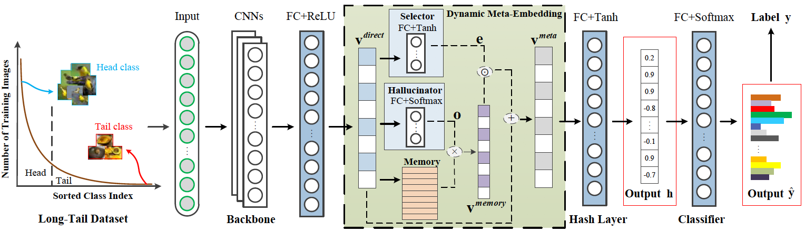

# Long-Tail Hashing

[[Paper]](https://) 

## Overview
`LTH Net` is the author's re-implementation of the long-tail hashing network described in:  
"[Long-Tail Hashing](https://arxiv.org/abs/****)"   
[Yong Chen](https://zero-lab-pku.github.io/personwise/chenyong/),&nbsp; [Yuqing Hou],&nbsp; [Shu Leng],&nbsp; [Qing Zhang],&nbsp; [Zhouchen Lin](https://zhouchenlin.github.io/),&nbsp; [Dell Zhang](https://www.dcs.bbk.ac.uk/~dell/)&nbsp; &nbsp; 
in ACM Special Interest Group on Information Retrieval (SIGIR) 2021, **Full Paper**



Further information please contact [Yong Chen](mailto:butterfly.chinese@pku.edu.cn).

## Update notifications
* __**/**/2021:__ We ***

## Requirements
* [PyTorch](https://pytorch.org/) (version >= ？)
* [scikit-learn](https://scikit-learn.org/stable/)

## Data Preparation

- First, please download the [ImageNet100](baidunetdisk) and [Cifar100](baidunetdisk).
Please put the downloaded files into the `data` directory like this:
```
data
  |--ImageNet100
    |--ImageNet100-IF1
    |--ImageNet100-IF10
    |--ImageNet100-IF20
    |--ImageNet100-IF50
    |--ImageNet100-IF100
  |--Cifar100
    |--Cifar100-IF1
    |--Cifar100-IF10
    |--Cifar100-IF20
    |--Cifar100-IF50
    |--Cifar100-IF100
```


## Training & Testing

```
python run.py --dataset imagenet100-IF10 (cifar100-IF10) --root your_data_root --code-length 32 --number-classes 100 --number-prototypes 100 --batch-size 128 --dynamic-meta-embedding True --dpp_k 3
```


## CAUTION
The current code was prepared using single GPU. 

## License and Citation
The use of this software is released under [BSD-3](https://github.com/zhmiao/OpenLongTailRecognition-OLTR/blob/master/LICENSE).
```
TODO
BIB for the paper
```
